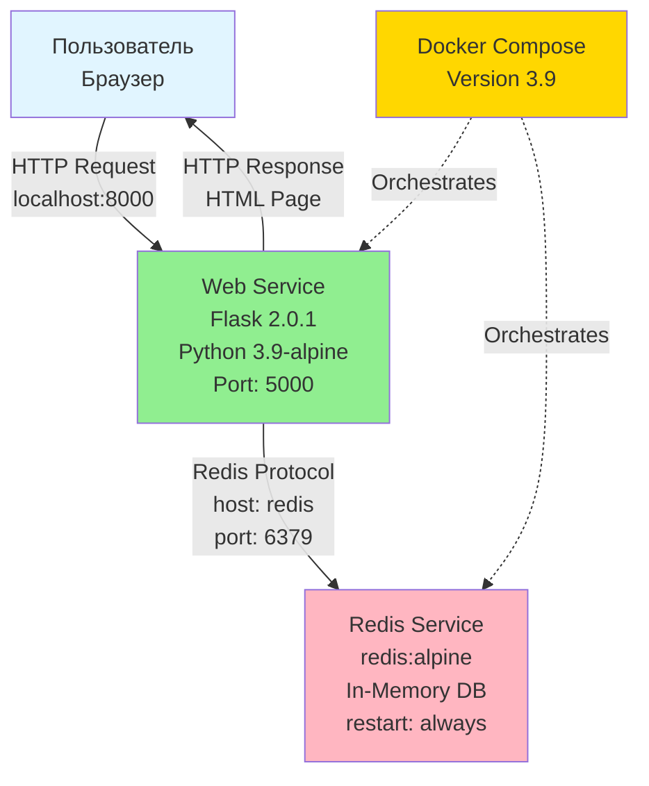

# rs_6

# Лабораторная работа 6 (Вариант 12)

## Описание проекта

Данный проект реализует микросервисную систему для подсчета посетителей с использованием Flask и Redis. Особенностью варианта 35 является реализация функции **"Счастливый посетитель"**: каждый седьмой посетитель (кратный 7) получает специальное поздравление зеленым цветом.

### Бизнес-кейс. "Счастливый посетитель"

Система ведет подсчет посетителей и при достижении числа, кратного 7, выводит специальное поздравление "Поздравляем! Вы счастливчик!" зеленым цветом. В остальных случаях отображается стандартное сообщение "Посетитель номер: X".

## Архитектура

Система построена на микросервисной архитектуре с использованием Docker Compose для оркестрации контейнеров. Ниже представлена диаграмма архитектуры:



### Компоненты системы

- **Web Service (Flask)**: 
  - Принимает HTTP-запросы от пользователей
  - Реализует бизнес-логику подсчета посетителей
  - Проверяет кратность числа 7 для функции "Счастливый посетитель"
  - Подключается к Redis для хранения счетчика
  
- **Redis Service**: 
  - Хранит счетчик посетителей в памяти
  - Обеспечивает быстрый доступ к данным
  - Настроен с политикой `restart: always` для высокой доступности
  
- **Docker Compose**: 
  - Оркестрирует запуск и взаимодействие сервисов
  - Управляет сетевой связностью между контейнерами
  - Обеспечивает зависимость `web` от `redis`

## Стек технологий

### Backend
- **Python 3.9** — язык программирования
- **Flask 2.0.1** — веб-фреймворк для создания REST API
- **Redis 4.6.0** — клиент для работы с Redis

### Инфраструктура и DevOps
- **Docker** — контейнеризация приложений
- **Docker Compose 3.9** — оркестрация многоконтейнерных приложений
- **Alpine Linux** — легковесный базовый образ для контейнеров

### База данных
- **Redis (alpine)** — in-memory хранилище данных (key-value store)

### Сетевые протоколы
- **HTTP/1.1** — протокол для взаимодействия клиента и веб-сервиса
- **Redis Protocol** — протокол для взаимодействия Flask и Redis

## Внесенные изменения по варианту 35

### 1. Бизнес-логика (`app.py`)
- Реализована проверка кратности числа посетителей 7
- При `count % 7 == 0` выводится поздравление зеленым цветом
- В остальных случаях - стандартное сообщение

### 2. Инфраструктура (`docker-compose.yml`)
- Добавлена политика перезапуска `restart: always` для сервиса Redis
- Это обеспечивает автоматический перезапуск Redis при сбоях

### 3. Среда сборки (`requirements.txt` и `Dockerfile`)
- Зафиксирована строгая версия Flask==2.0.1
- Указана стабильная версия redis==4.6.0

## Инструкция по запуску

### Предварительные требования
- Docker Engine установлен и запущен
- Docker Compose V2 доступен (команда `docker compose`)

### Шаги запуска

1. **Сборка и запуск контейнеров:**
   ```bash
   docker compose up -d --build
   ```

2. **Проверка статуса контейнеров:**
   ```bash
   docker compose ps
   ```

3. **Просмотр логов (опционально):**
   ```bash
   docker compose logs -f
   ```

4. **Открытие приложения:**
   Откройте браузер и перейдите по адресу: `http://localhost:8000`

5. **Тестирование логики "Счастливого посетителя":**
   - Обновите страницу несколько раз (F5 или Ctrl+R)
   - При достижении чисел 7, 14, 21, 28 и т.д. вы увидите зеленое поздравление

### Остановка контейнеров

```bash
docker compose down
```

## Проверка работоспособности

### 1. Проверка запущенных контейнеров
```bash
docker compose ps
```
Должны быть видны два контейнера: `web` и `redis`, оба в статусе "Up".

### 2. Проверка версии Flask
Для проверки, что установлена именно версия Flask 2.0.1:
```bash
docker compose exec web pip show flask
```
В выводе должна быть строка `Version: 2.0.1`.

### 3. Ручное тестирование логики "Счастливого посетителя"
1. Откройте браузер: `http://localhost:8000`
2. Обновите страницу 7 раз (F5)
3. На 7-м обновлении должно появиться зеленое сообщение "Поздравляем! Вы счастливчик!"
4. Продолжите обновлять - на 14-м, 21-м и т.д. также будет поздравление

### 4. Проверка работы Redis
Для проверки подключения к Redis можно выполнить:
```bash
docker compose exec redis redis-cli GET hits
```
Команда покажет текущее значение счетчика.

## Структура проекта

```
.
├── app.py                 # Основное Flask-приложение
├── Dockerfile             # Инструкции для сборки образа
├── docker-compose.yml     # Конфигурация оркестрации сервисов
├── requirements.txt       # Зависимости Python
├── README.md             # Задание лабораторной работы и Документация проекта
```

## Пошаговая инструкция по проверке работоспособности системы

### Шаг 1. Сборка и запуск контейнеров

Выполните команду для сборки и запуска контейнеров (используя синтаксис Docker Compose V2):

```bash
docker compose up -d --build
```

Эта команда:
- Соберет образ для веб-сервиса из Dockerfile
- Загрузит образ Redis:alpine
- Запустит оба контейнера в фоновом режиме (`-d`)

**Ожидаемый результат:** Вы увидите процесс сборки образа и запуска контейнеров. В конце должны появиться сообщения о создании и запуске контейнеров.

### Шаг 2. Проверка списка запущенных контейнеров

Выполните команду для просмотра статуса контейнеров:

```bash
docker compose ps
```

**Ожидаемый вывод:**
- Контейнер `web` — статус "Up", порты "0.0.0.0:8000->5000/tcp"
- Контейнер `redis` — статус "Up"

Оба контейнера должны быть в состоянии "Up" и работать корректно.

### Шаг 3. Ручное тестирование логики "Счастливого посетителя"

1. **Откройте браузер** и перейдите по адресу: `http://localhost:8000`

2. **Обновите страницу 7 раз** (используйте F5 или Ctrl+R):
   - **Первые 6 обновлений:** Вы увидите обычные сообщения:
     - "Посетитель номер: 1"
     - "Посетитель номер: 2"
     - "Посетитель номер: 3"
     - и так далее до "Посетитель номер: 6"
   
   - **На 7-м обновлении:** Должно появиться зеленое сообщение:
     - "Поздравляем! Вы счастливчик!"
     - "Вы посетитель номер: 7"
   
   - **На 8-м обновлении:** Снова обычное сообщение "Посетитель номер: 8"
   
   - **На 14-м, 21-м, 28-м и т.д. обновлениях:** Снова будет появляться поздравление

3. **Проверьте визуально:** Зеленое поздравление должно быть четко видно и отличаться от обычного сообщения.

### Шаг 4. Проверка версии Flask внутри контейнера

Для проверки, что установлена именно зафиксированная версия Flask 2.0.1, выполните:

```bash
docker compose exec web pip show flask
```

**Ожидаемый вывод:**
```
Name: Flask
Version: 2.0.1
...
```

В строке `Version:` должно быть указано `2.0.1` — это подтверждает, что установлена правильная версия.

### Дополнительные команды для проверки

**Просмотр логов приложения:**
```bash
docker compose logs web
```
Покажет все логи веб-сервиса, включая сообщения Flask.

**Просмотр логов Redis:**
```bash
docker compose logs redis
```

**Просмотр логов всех сервисов в реальном времени:**
```bash
docker compose logs -f
```

**Проверка значения счетчика в Redis:**
```bash
docker compose exec redis redis-cli GET hits
```
Команда покажет текущее значение счетчика посетителей, хранящееся в Redis.

**Остановка контейнеров:**
```bash
docker compose down
```

**Перезапуск после изменений в коде:**
```bash
docker compose up -d --build
```

### Устранение возможных проблем

**Если контейнеры не запускаются:**
- Проверьте, что Docker Engine запущен: `docker ps`
- Проверьте логи: `docker compose logs`
- Убедитесь, что порт 8000 не занят другим приложением

**Если приложение не отвечает:**
- Проверьте статус контейнеров: `docker compose ps`
- Убедитесь, что оба контейнера в статусе "Up"
- Проверьте логи веб-сервиса: `docker compose logs web`

**Если Redis недоступен:**
- Проверьте логи Redis: `docker compose logs redis`
- Убедитесь, что политика `restart: always` работает корректно
